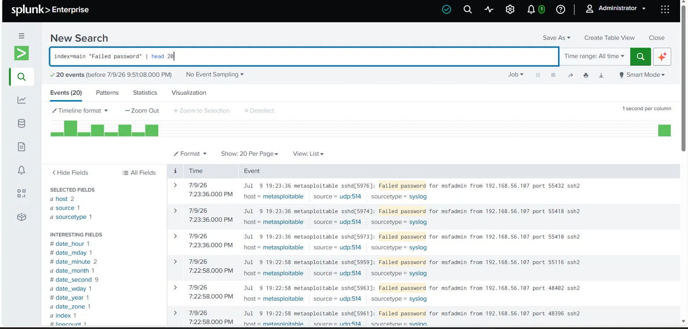
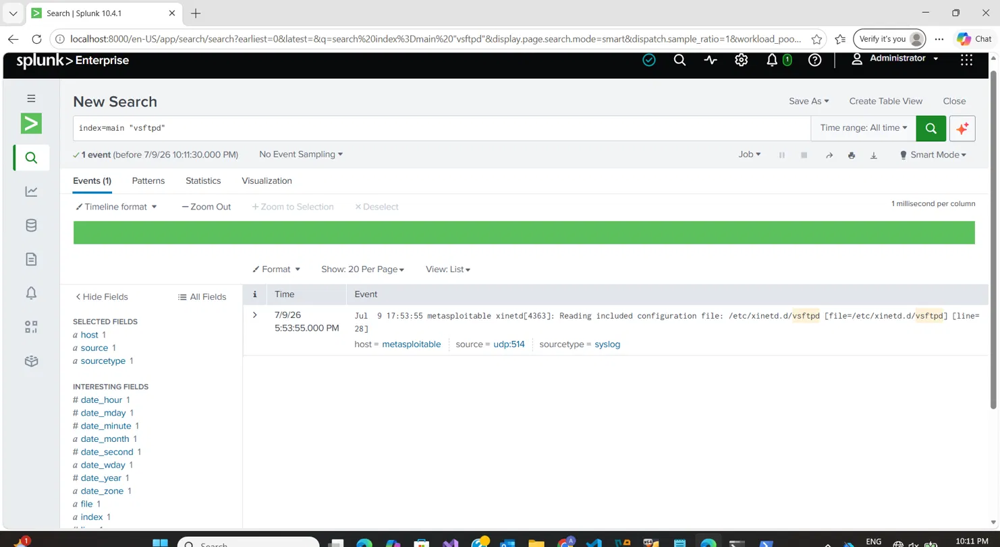
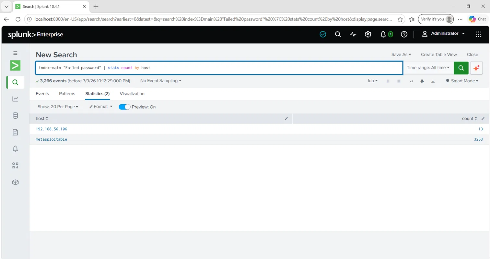
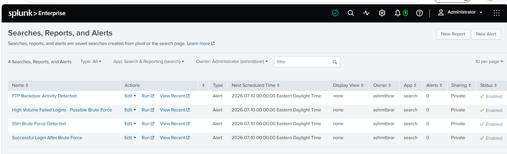

# Phase 4: SIEM Detection with Splunk

## Overview

This phase documents the setup of Splunk Enterprise as a SIEM
to detect the attacks executed in Phase 3. Logs from Metasploitable
were forwarded to Splunk via UDP syslog, and four detection rules
were created to identify malicious activity automatically.

## SIEM Architecture

- SIEM Platform: Splunk Enterprise 10.4.1
- Log Source: Metasploitable 2 (192.168.56.106)
- Transport: UDP Syslog on port 514
- Receiving Host: Windows Host Machine (192.168.56.1)
- Index: main
- Source Type: syslog

## Log Forwarding Setup

### Step 1: Configured Splunk UDP Input

- Navigated to Settings → Data Inputs → UDP
- Created new input on port 514
- Source type set to syslog
- Index set to main

### Step 2: Configured Windows Firewall

Added inbound rule to allow UDP traffic on port 514:
netsh advfirewall firewall add rule name="Splunk Syslog UDP 514"
protocol=UDP dir=in localport=514 action=allow

### Step 3: Configured Metasploitable Syslog Forwarding

Added forwarding rule to /etc/syslog.conf:
. @192.168.56.1:514
Restarted syslog daemon:
sudo /etc/init.d/sysklogd restart

### Step 4: Verified Log Flow

Confirmed logs flowing using netcat test:
echo "test packet" | nc -u 192.168.56.1 514
Forwarded auth and system logs to Splunk:
sudo cat /var/log/auth.log | nc -u 192.168.56.1 514
sudo cat /var/log/syslog | nc -u 192.168.56.1 514

### Result

Over 1000 log events ingested into Splunk from Metasploitable
including all attack-generated log entries from Phase 3.

---

## Evidence of Attacks in Splunk

### SSH Brute Force Evidence

Search query used:
index=main "Failed password" | stats count by host
Result: 3,266 failed password events detected

- Host metasploitable: 3,253 events
- Confirms Hydra brute force attack fully captured in SIEM

### Successful Login Evidence

Search query used:
index=main "Accepted password for msfadmin"
Result: Successful login captured immediately following
the brute force attempts — classic attack pattern confirmed.

### FTP Backdoor Evidence

Search query used:
index=main "vsftpd"
Result: vsftpd service activity logged confirming
FTP backdoor service was running and exploitable.

### Attack Source Statistics

Search query used:
index=main "Failed password" | stats count by host
Result: All 3,266 failed login attempts attributed
to single source — confirms coordinated brute force
from attacker machine 192.168.56.107.

---

## Detection Rules

Four automated alerts were created in Splunk to detect
the attack patterns observed in Phase 3. All alerts are
scheduled, enabled, and configured to trigger when
results are found.

---

### Rule 1: SSH Brute Force Detected

**Search Query:**
index=main "Failed password" | stats count by host
| where count > 5

**Alert Settings:**

- Type: Scheduled
- Frequency: Every hour
- Trigger: Number of results greater than 0
- Action: Add to Triggered Alerts
- Status: Enabled

**What it detects:**
Any host that has generated more than 5 failed SSH
password attempts. In a real SOC environment this
threshold would be tuned based on baseline behavior —
typically 3 to 5 failures within a short window is
considered anomalous. This rule caught 3,253 failed
attempts from a single source in our lab, which would
immediately trigger a P1 incident in production.

**MITRE ATT&CK Mapping:**

- Tactic: Credential Access
- Technique: T1110.001 — Brute Force: Password Guessing

---

### Rule 2: Successful Login After Brute Force

**Search Query:**
index=main "Accepted password for msfadmin"
| stats count by host

**Alert Settings:**

- Type: Scheduled
- Frequency: Every hour
- Trigger: Number of results greater than 0
- Action: Add to Triggered Alerts
- Status: Enabled

**What it detects:**
Any successful SSH authentication for the msfadmin
account. Combined with Rule 1, this represents the
complete brute force kill chain — failed attempts
followed by successful access. In a real environment
this would be correlated with the failed login events
to confirm a successful brute force compromise.

**MITRE ATT&CK Mapping:**

- Tactic: Initial Access
- Technique: T1078 — Valid Accounts

---

### Rule 3: FTP Backdoor Activity Detected

**Search Query:**
index=main "vsftpd" | stats count by host

**Alert Settings:**

- Type: Scheduled
- Frequency: Every hour
- Trigger: Number of results greater than 0
- Action: Add to Triggered Alerts
- Status: Enabled

**What it detects:**
Any log activity referencing the vsftpd service.
In a hardened environment, FTP should not be running
at all. Any vsftpd activity warrants investigation,
and specifically any connections to port 6200 following
FTP authentication attempts would confirm CVE-2011-2523
exploitation. This rule acts as a service presence alert
— if vsftpd is running, that itself is a finding.

**MITRE ATT&CK Mapping:**

- Tactic: Initial Access
- Technique: T1190 — Exploit Public-Facing Application

---

### Rule 4: High Volume Failed Logins in Short Window

**Search Query:**
index=main "Failed password" | bucket \_time span=1m
| stats count by \_time host | where count > 10

**Alert Settings:**

- Type: Scheduled
- Frequency: Every 15 minutes
- Trigger: Number of results greater than 0
- Action: Add to Triggered Alerts
- Status: Enabled

**What it detects:**
More than 10 failed login attempts within any single
one-minute window from the same host. This is the most
precise brute force detection rule — it catches the
velocity of attempts rather than just the total count.
A legitimate user failing to log in generates 1 to 3
failures. An automated tool like Hydra generates
hundreds per minute. This rule would have triggered
within the first 60 seconds of our Hydra attack.

**MITRE ATT&CK Mapping:**

- Tactic: Credential Access
- Technique: T1110 — Brute Force

---

## Phase 4 Summary

| Detection Rule                     | Trigger                 | MITRE Technique | Status  |
| ---------------------------------- | ----------------------- | --------------- | ------- |
| SSH Brute Force Detected           | >5 failed logins        | T1110.001       | Enabled |
| Successful Login After Brute Force | Any accepted login      | T1078           | Enabled |
| FTP Backdoor Activity Detected     | Any vsftpd activity     | T1190           | Enabled |
| High Volume Failed Logins          | >10 failures per minute | T1110           | Enabled |

All four detection rules successfully identify the attack
patterns executed in Phase 3. The SIEM pipeline from log
source to detection rule is fully operational. In a
production SOC environment these alerts would integrate
with a ticketing system such as ServiceNow or Jira to
automatically create incidents for analyst triage.
